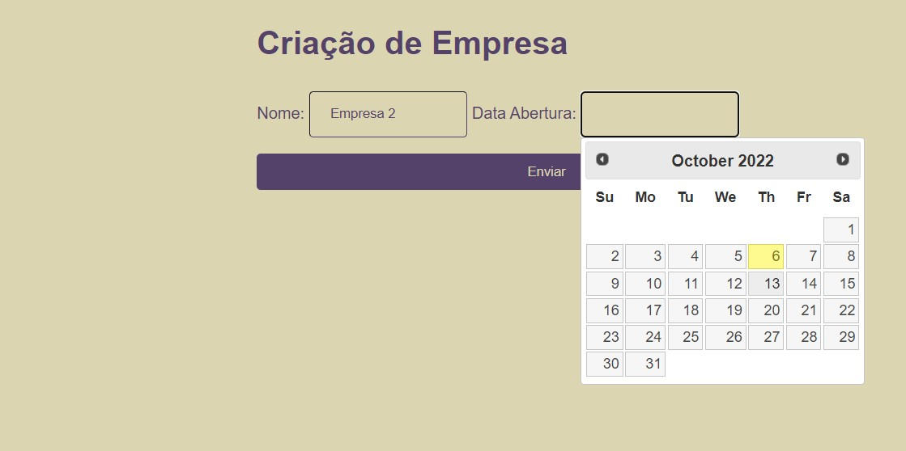
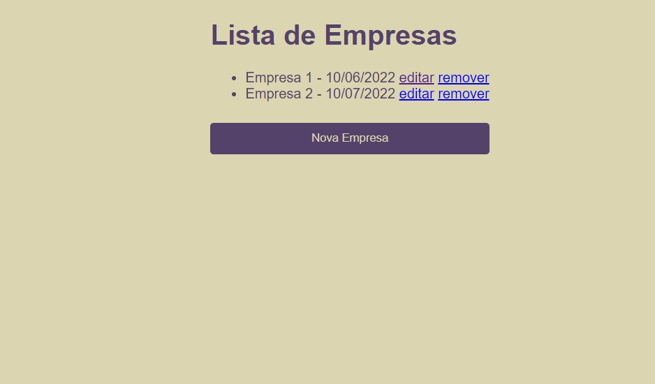

# java-fundamentos-web-api-servlet

	English | <a href="https://github.com/samlatavares/java-fundamentos-web-api-servlet/blob/main/translations/pt-br/README.md">Português</a>

</img>

</img>

## What is this project?
- This project was made during <a href="https://cursos.alura.com.br/course/servlets-fundamentos-programacao-web-java">this</a> Alura's course and is an example of a servlet using Tomcat.
- It is a simple CRUD that allows the person that is using it to create, update, delete and visualize the companies data.

## Used Tools
- Java 10
- Tomcat 9
- JSP
- HTML

## How to run this project?
- Clone this repository in your local machine
- Install Java 10
- Install Tomcat 9
- Install Eclipse
- Open eclipse and select the workspace (folder where the repository is)
- Start the Tomcat Server
- Open a tab in your browser and access the link: http://localhost:8080/gerenciador/listaEmpresas

## Thank you!
Thank you for checking this repository!